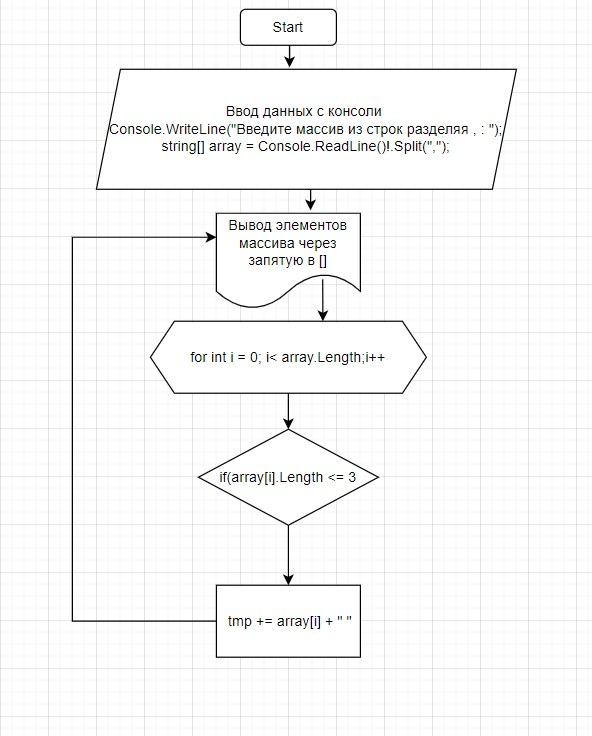

# Final_project
- - - 

## Задание
## этапы:
1. Ввод элементов с клавиатуры через запятую

***Console.WriteLine("Введите массив из строк разделяя , : ");***

***string[] array = Console.ReadLine()!.Split(",");***

2. Вывод полученного массива в консоль в [] через запятую с помощью метода ***ShowStringArray(array)***

void ShowStringArray(string[] arr)

{

    Console.WriteLine($"[{String.Join(", ",arr)}]");
}

3. С помощью метода ***string[] GetElementsLowerThree(string[] arr)*** сортируем массив (отбираем элементы, в которых количество символов <=3>);

* задаем переменную tmp и присваиваем ей пустую строку;

* далее задаем цикл for и проходим по всем элементам массива;

* если arrray[i].Length<=3, его значение присваивается переменной tmp;

* далее записываем все значения tmp в массив  string[] res;

4. Выводим в консоль  массив res с помощью метода 

***void ShowStringArray(string[] arr)***

# Блок-схема

